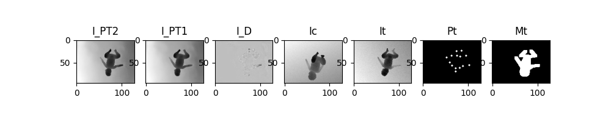
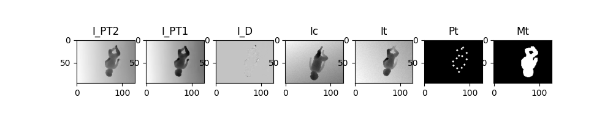
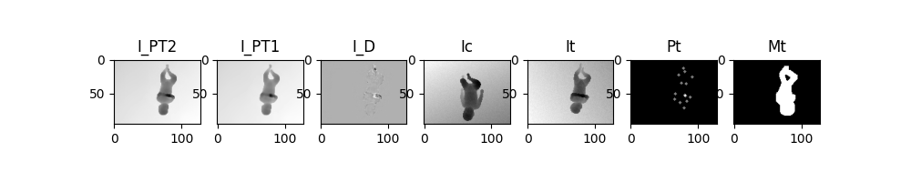
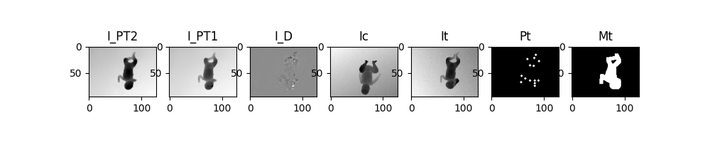

# Generating depth images of preterm infants with a given pose using GANs

<div align="center">
    
    <br>
    <figcaption ><em>Fig.1: proposed GAN-based framework</em></figcaption>
</div>
<br>

In this repository is the Tensorflow implementation of the proposed GAN-based framework described in "Generating depth images of preterm infants with a given pose using GANs"
paper and shown in Figure 1. 

The proposed bibranch architecture is in <a href="./src/models/bibranch">./src/models/bibranch<a> directory, 
while the network architecture present in literature <i>(mono-branch GAN-based framework)</i> is in <a href="./src/models/mono">./src/models/mono<a> directory.

The dataset used for training and evaluation phases is the MINI-RGBD available online. We applied to them some trasformations. For more information see <a href="./data/Syntetich_complete">./data/Syntetich_complete</a>

The framework can be used by choosing between the available architectures and datasets. Alternatively, you can define your own datasets or architectures to be used.
For both options please refer to sections <a href="#2-define-dataset">2</a> and in <a href="#3-define-network-architecture">3</a>
for the creation of the dataset and architectures, while section <a href="#2-define-dataset">4</a> explains how to start the framework.

# 1. Install enviroment

Code was run using the dependencies described in <i>Dockerfile</i>. To prepare the environment, follow these steps:

1. Download the Github repository
```
sudo apt install unzip
wget https://github.com/GiuseppeCannata/BabyPoseGuided/archive/master.zip
unzip master.zip
mv BabyPoseGuided-master BabyPoseGuided
```

2. Move in BabyPoseGuided directory
```
cd BabyPoseGuided
```

3. You can download the <i>ganinfant:1.0.0</i> docker image by running the follow istructions. <b>Note:</b> The <i>gainfant:1.0.0</i> docker image inherits layers from <a href="https://hub.docker.com/r/tensorflow/tensorflow">tensorflow/tensorflow</a> image with <i>-gpu</i> tag. This needs nvidia-docker to run as you can read in optional section of the same.
```
docker pull giuseppecannata/ganinfant:1.0.0
docker tag giuseppecannata/ganinfant:1.0.0 ganinfant:1.0.0
```
	
4. Start the container <i>GAN_infant_container</i> with the docker image <i>ganinfant:1.0</i>. 
In the following instruction, you need to replace <id_gpu> with your GPU id, <local_directory> with the absolute path of the 
BabyPoseGuided directory described at point (1.) , <container_directory> absolute path where the container will mount the <local_directory>
```
docker run -it --name "GAN_infant_container" --gpus "<id_gpu>"  -v <local_directory>:<container_directory> ganinfant:1.0.0 bash 
```

# 2. Define dataset

<h4>2.1 Define dataset directory</h4>
You have the possibility to define your own dataset and the related configurations to be used in the framework.<br>
Each defined dataset must be placed in the <a href="./data">./data</a> directory and must respect a specific structure.
For more information, you can refer to the <a href="./data">./data/REAMDE</a> file.
<br>

<h4>2.2 Define python processing module</h4>
To each [type] of dataset is associated a related <b>python processing module</b> defined in <a href="./src/datasets">./src/dataset</a>.<br>
For more information you can refer to the <a href="./src/datasets">./src/dataset/README</a>.<br>
<br>

# 3. Define network architecture
To use the framework you have the possibility to define your own architecture.<br>
Each defined architecture must be placed in the <a href="./src/models">./src/models</a> directory.
For more information refer to the <a href="./src/models">./src/models/README</a> file.

# 4. Usage
Once the environment has been installed and the dataset and architecture have been defined, the framework can be used.

<h4>4.1 Set configuration</h4>
In particular we need to set the <a href="./configuration.yml">configuration file</a>.

<h4><a href="./configuration.yml#L1">- enviroment_variables</a></h4>
<dl>
<dt><a href="./configuration.yml#L2">MODE</a></dt>
<dd>
Specify the mode to start the framework. The list of MODE value is given below:
    <ul>
        <li>train_G1: train generator G<sub>1</sub> </li> 
        <li>train_cDCGAN: train the conditional Generative Adversarial Network </li>
        <li>evaluate_G1: calculate FID and IS scores of G<sub>1</sub> </li>
        <li>evaluate_GAN: calculate FID and IS scores of all framework</li>
        <li>tsne_GAN: calculate t-sne of all framework</li>
        <li>inference_G1: inference on test set using G<sub>1</sub> </li>
        <li>inference_GAN: inference on test set using all framework</li>
		<li>plot_history_G1:  plot history file of G<sub>1</sub> training</li>
		<li>plot_history_GAN: plot history file of GAN training</li>
    </ul>
</dd>

<dt><a href="./configuration.yml#L3">DATASET</a></dt>
<dd>
Name of the dataset you want to use. 
The directory of dataset must be contained in <a href="./data">./data</a> directory 
and must present the following pattern in the name: [type][underscore][note].
</dd>

<dt><a href="./configuration.yml#L4">DATASET_CONFIGURATION</a></dt>
<dd>
Name of the dataset configuration you want to use. 
The directory of configuration must be contained as sub-folder in tfrecord directory.
</dd>

<dt><a href="./configuration.yml#L5">ARCHITECTURE</a></dt>
<dd>
Name of the architecture you want to use. 
The directory of architecture must be contained in <a href="./src/models">./src/models</a> directory.
</dd>

<dt><a href="./configuration.yml#L6">OUTPUTS_DIR</a></dt>
<dd>
Name of directory in which to save the results of training, validation and inference.
</dd>

<dt><a href="./configuration.yml#L7">G1_NAME_WEIGHTS_FILE</a></dt>
<dd>
Name of .hdf5 file to load in G<sub>1</sub> model.<br>
The file will be find in OUTPUTS_DIR/weights/G1 directory. <br>
This variable will be read only if MODE is one of this: ['inference_G1', 'evaluate_G1', 'train_cDCGAN', 'evaluate_GAN', 'tsne_GAN', 'inference_GAN'].
</dd>

<dt><a href="./configuration.yml#L8">G2_NAME_WEIGHTS_FILE</a></dt>
<dd>
Name of .hdf5 file to load in G<sub>2</sub> model.<br>
The file will be find in OUTPUTS_DIR/weights/GAN directory. <br>
This variable will be read only if MODE is one of this: ['evaluate_GAN', 'inference_GAN', 'tsne_GAN'].
</dd>
</dl>

<h4><a href="./configuration.yml#L10">- G1_train_info</a></h4>
Here we can set the information about G<sub>1</sub> train.
These variables will be read only if MODE is 'train_G1'.

<h4><a href="./configuration.yml#L19">- GAN_train_info</a></h4>
Here we can set the information about GAN train.
These variables will be read only if MODE is 'train_cDCGAN'.

<h4>4.2 Run main</h4>
Once the configuration have been set run: 

```
python src/main.py
```


# 5. Qualitative Results
In this section, some qualitative results obtained using the bibranch architecture and the Syntetcih_complete dataset 
(configuration negative_no_flip_camp_5_keypoints_2_mask_1) are presented.

<ul>
	<li> I_PT2 = I_PT1 + I_D </li>
	<li> I_PT1 = output of G1 generator </li>
	<li> I_D = output of G2 generator </li>
	<li> Ic = condition image </li>
	<li> It = target image </li>
	<li> Pt = target pose </li>
	<li> Mt = target binary mask </li>
</ul>

<table>
    <tr><th></th></tr>
	<tr><th></th></tr>
	<tr><th></th></tr>
	<tr><th></th></tr>
</table>
