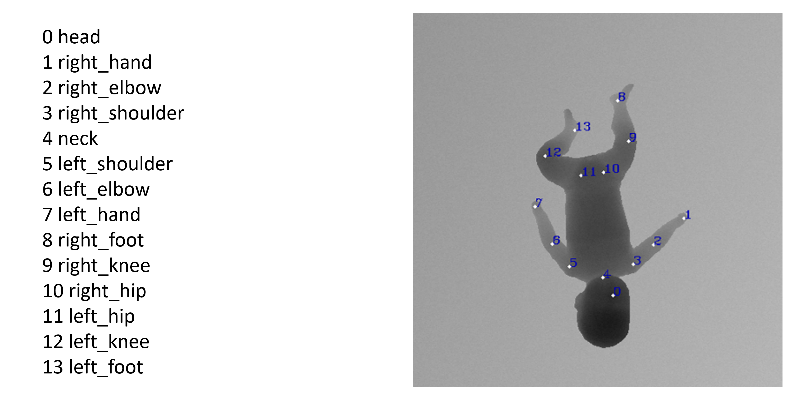

The images used are taken from the dataset available online: <a href="https://www.iosb.fraunhofer.de/en/competences/image-exploitation/object-recognition/sensor-networks/motion-analysis.html ">MINI-RGBD</a> (7 Gb).
 
Each directory and its contents are described below.

<h3> 1. pz[id_unique] </h3>
Here we have named each folder with pz[id_unique]. <i>id_unique</i> is an integer with which we uniquely distinguish each infant. 
Each of the folders refers to the corresponding folder in:  MINI-RGBD_web\imgs\.
 
For each of the pz<id_unique> we have:
<ul>
  <li>1000 16-bit images, already in the MINI-RGBD and viewable by downloading the Fiji program</li>
  <li>1000 8-bit images, not present in the MINI-RGBD but were obtained by performing a 16-bit conversion</li>
</ul>
The size of the images is height = 480 pixels and width = 640 pixels. The images have not been pushed to GitHub.
 
<i>Please refer to section 4.1 for more details on image transformations.</i>

<h3> 2. annotations </h3>
In the annotations folder, for each pc and each image we have the relevant annotations organised in a file <i>.csv</i>.
Opening the file, for each image <i>(whose name is shown in the image column)</i> we have the relevant annotations of the keypoints. 
In particular, the annotations are written as follows: [coordinata_x],[coordinata_y].
 
<i>For more details on annotation transformations, and to view keypoints refer to section 4.2.</i>

<h3> 3. tfrecord </h3>
In the tfrecord folder are the sets of: train, valid e test for the training and validation part.
In addition, the file <i>sets_config.pkl</i> is created automatically during the creation of the tfrecods and contains the configurations of the dataset:
radius_head value, radius_keypoints value. the <i>.tfrecord</i> and <i>sets_config.pkl</i> files are created by th src/0_DatasetGenerator.py.
 
 
<h3> 4.  Trasformations </h3> 

<h4> 4.1 Immagini </h4> 
Each of the images in the folders pz[id_unique] has the following changes compared with the MINI-RGBD:
<ul>
  <li>90 degree clockwise rotation of images</li>
</ul>

<h4> 4.2 Annotations </h4> 
In order to cope with image transformations, we have also applied transformations to the Keypoints. In particular:
<ul>
  <li>Rotation of 90 of the relevant records</li>
</ul>

In addition, we have reduced the original MINI-RGBD annotations:
<ul>
  <li>Simplification of KP annotations (from 24 to 14)</li>
</ul>
 
The keypoints considered are:
  

  

