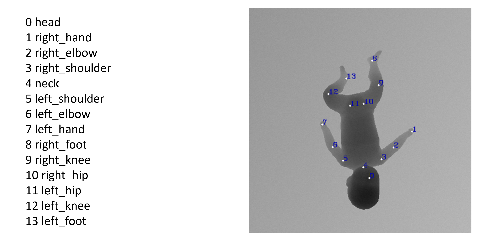

Le immagini utilizzate sono prese dal dataset disponibile online: <a href="https://www.iosb.fraunhofer.de/en/competences/image-exploitation/object-recognition/sensor-networks/motion-analysis.html ">MINI-RGBD</a> (7 Gb).
Di seguito è descritto ogni directory e il suo contenuto.

<h3> 1. Pz[unique] </h3>
Qui abbiamo denominato ogni cartella con pz[num_unique_infante]. Ognuna delle cartelle fa riferimento alla corrispettiva presente in:  MINI-RGBD_web\imgs\
Per ognuna delle pz<num_unique_infante> abbiamo:
<ul>
  <li>1000 immagini a 16 bit, già presenti nel MINI-RGBD e visualizzabili scaricando il programma Fiji.</li>
  <li>1000 immagini a 8 bit, queste ultime non erano presenti nel MINI-RGBD ma sono state ricavate effettuando una conversione dalle 16 bit</li>
</ul>
La dimensione delle immagini è altezza = 480 pixels mentre la larghezza = 640 pixels. Le immagini non sono state pushate in GitHub.
 
<i>Per maggiori dettagli sulle trasformazioni delle immagini fare riferimento alla sezione 3.1</i>

<h3> 2. Annotations </h3>
Nella certella annotazioni, per ogni pz e per ogni immagine abbiamo le relative annotazioni organizzate in un file <i>.csv</i>.
Aprendo il file, per ogni immagine <i>(il cui nome è riportato nella colonna image)</i> abbiamo le relative annotazioni dei keypoints. 
In particolare, le annotazioni sono cosi scritte: [coordinata_x],[coordinata_y].
 
<i>Per maggiori dettagli sulle trasformazioni delle annotazioni, e per visualizzare i keypoints fare riferimento alla sezione 3.2</i>

<h3> 3. tfrecord </h3>
Nella cartella tfrecord sono presenti i set di: train, valid e test per la parte di training e validazione.
Inoltre, il file pair_tot_sets.pkl viene creato in automatico durante la creazione dei tfrecods e contiene le info: radius_head, radius_keypoints utilizzate durante la formazione dei sets.

<h3> 4.  Trasformazioni </h3> 

<h4> 4.1 Immagini </h4> 
Ognuna delle immagini presenti nelle cartellle pz<num_unique_infante> presenta le seguenti trasformazioni rispetto a quelle del MINI-RGBD:
- Rotazione di 90 gradi in senso orario delle immagini

<h4> 4.2 Annotazioni </h4> 
Per far fronte alle trasformazioni delle immagini, abbiamo applicato anche delle trasformazioni ai Keypoints. In particolare:
- Rotazione di 90 delle relative annotazioni

Inoltre, abbiamo ridotto le annotazioni originali del MINI-RGBD:
- Semplificazione delle annotazioni dei KP (da 24 a 14)
  
I keypoints considerati sono:
 

  

