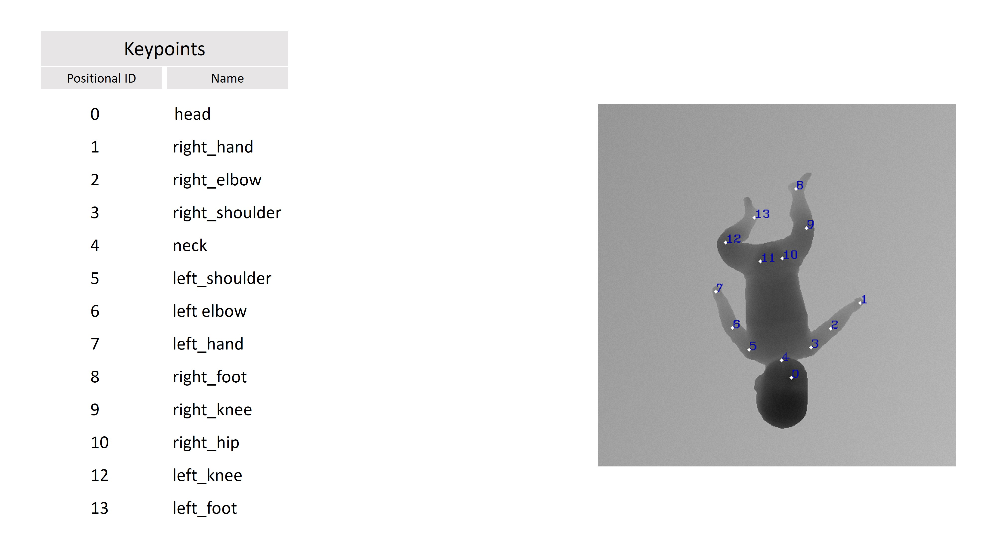

This dataset refers to <a href="https://www.iosb.fraunhofer.de/en/competences/image-exploitation/object-recognition/sensor-networks/motion-analysis.html ">MINI-RGBD</a> (7 Gb) available online.
We perform on MINI-RGBD some modifications to obtain the Syntetcih_complete. The modifications are describerd below.
 

<h3> 1. pz[id unique] </h3>
We have named each directory with pz[id unique]. [id unique] is an integer with which we uniquely distinguish each infant. 
 
Each of the pz[id unique] directory refers to a specific directory in the MINI-RGBD dataset described in the README file of each pz[id unique] directory.
  
Each of pz[id unique] directory contains:
<ul>
  <li>1000 16-bit images, already in the MINI-RGBD and viewable by downloading the <a href="https://imagej.net/software/fiji/downloads">Fiji</a> program</li>
  <li>1000 8-bit images, not present in the MINI-RGBD. We obtained them performing a conversion in <i>uint8</i> from 16-bit images</li>
</ul>
The images have not been pushed to GitHub, but you can download it and apply the trasformation describe in section 4.1.

<h3> 2. annotations </h3>
In the annotations directory, for each pz[id unique] there is <i>result_pz[id unique].csv</i> file containing the annotations on the keypoints. 
In particular, the keypoints annotations are written as follows: [coordinata_x],[coordinata_y].
  
The annotations files have been pushed to GitHub. If you want to know more details on annotations transformations respect to MINI-RGBD please refer to section 4.2.</i>

<h3> 3. tfrecord </h3>
In the tfrecord directory there are the sub-folders related to dataset's <i>configurations</i>. 
 
In each of configuration directory there are:
<ul>
<li> the train, valid e test sets files in .tfrecord format</li>
<li> sets_config file in pikle (.pkl) format that containg the infos on configuration. </li>
</ul>
These files are created by the 
<a href="../Dataset_configuration_generator.py">../Dataset_configuration_generator.py</a> and are used by the framework.
 

<h3> 4.  Trasformations </h3> 

<h4> 4.1 Images </h4> 
Each of the images in the folders pz[id unique] has the following changes compared with the MINI-RGBD:
<ul>
  <li>90 degree clockwise rotation of images</li>
</ul>

<h4> 4.2 Annotations </h4> 
In order to cope with image transformations, we have also applied transformations to the annotations.  
In particular:
<ul>
  <li>Rotation of 90 of the rlated annotations</li>
</ul>
In addition, we have reduced the original MINI-RGBD annotations:
<ul>
  <li>Simplification of keypoints annotations (from 24 to 14)</li>
  <li>New positional IDs given to keypoints</li>
</ul>

<h4> 4.3 Example </h4> 
Below we post an example of image and reletive annotations of <i>Syntetch_complete</i> dataset:
  
